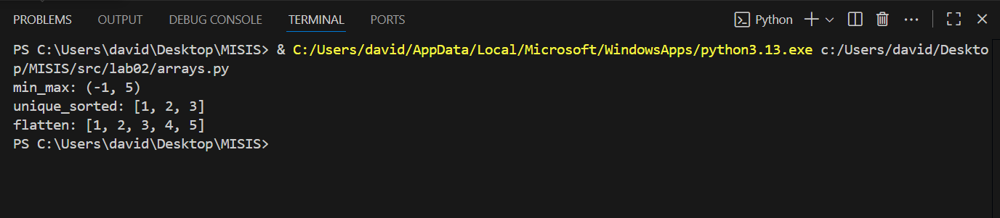
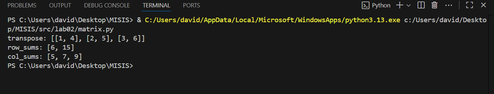
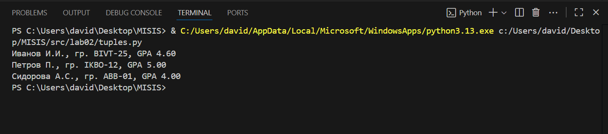

# ЛР2 — Коллекции и матрицы

## arrays.py
Descrição:
O arquivo arrays.py contém funções para manipular listas simples e compostas:
- min_max(nums) — retorna o menor e o maior elemento da lista.  
- unique_sorted(nums) — retorna uma lista ordenada sem duplicatas.  
- flatten(mat) — transforma uma lista de listas em uma única lista.

Exemplo de execução:

min_max: (-1, 5)
unique_sorted: [1, 2, 3]
flatten: [1, 2, 3, 4, 5]

## matrix.py
Descrição:
O arquivo matrix.py contém funções para operar com matrizes (listas de listas):

transpose(mat) — retorna a matriz transposta.

row_sums(mat) — calcula a soma de cada linha.

col_sums(mat) — calcula a soma de cada coluna.

Exemplo de execução
transpose: [[1, 3], [2, 4]]
row_sums: [6, 15]
col_sums: [5, 7, 9]

## tuples.py
Descrição:
O arquivo tuples.py trabalha com tuplas que representam registros de estudantes.
A função principal é:

format_record(rec) — formata uma tupla (ФИО, группа, GPA) em uma string legível,
por exemplo: Иванов И.И., гр. BIVT-25, GPA 4.60

Exemplo de execução:
Иванов И.И., гр. BIVT-25, GPA 4.60
Петров П., гр. IKBO-12, GPA 5.00
Сидорова А.С., гр. ABB-01, GPA 4.00

