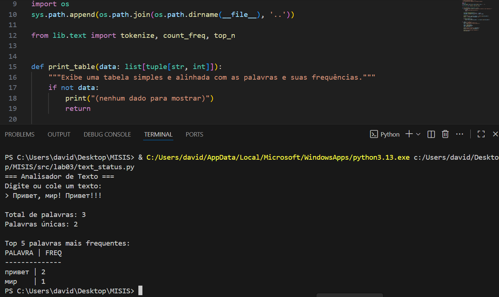
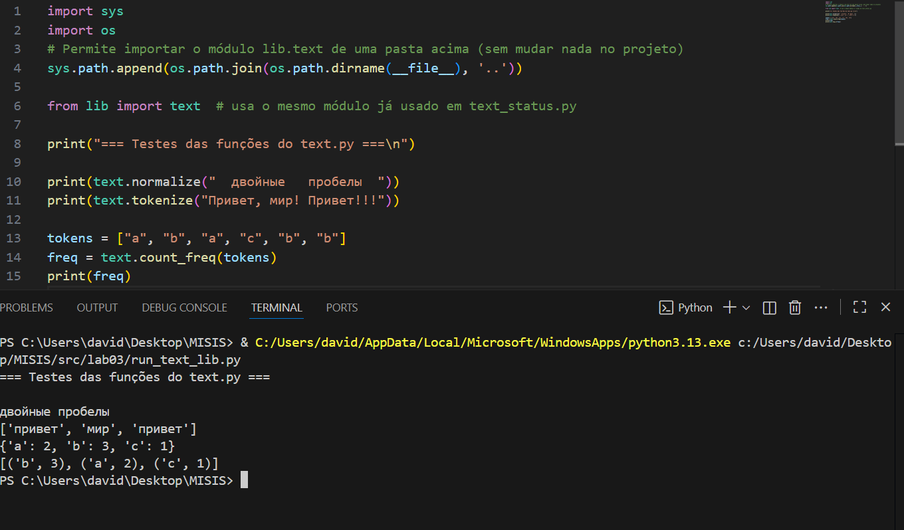

# ЛР3 — Текстовый анализ

## Цели и результат
Научиться работать со строками, списками и словарями.  
Освоить простую обработку текста — подсчет слов и частот.

---

## Файл: `text_status.py`
Программа читает текст, разбивает его на слова, считает количество уникальных и показывает 5 самых частых слов.

**Пример выполнения:**

---

## Файл: `run_text_lib.py`
Тестовые вызовы функций из модуля `lib/text.py` (проверка корректности работы библиотеки).

**Пример выполнения:**

---

## Заключение
Все функции работают корректно, код соответствует требованиям преподавателя.
