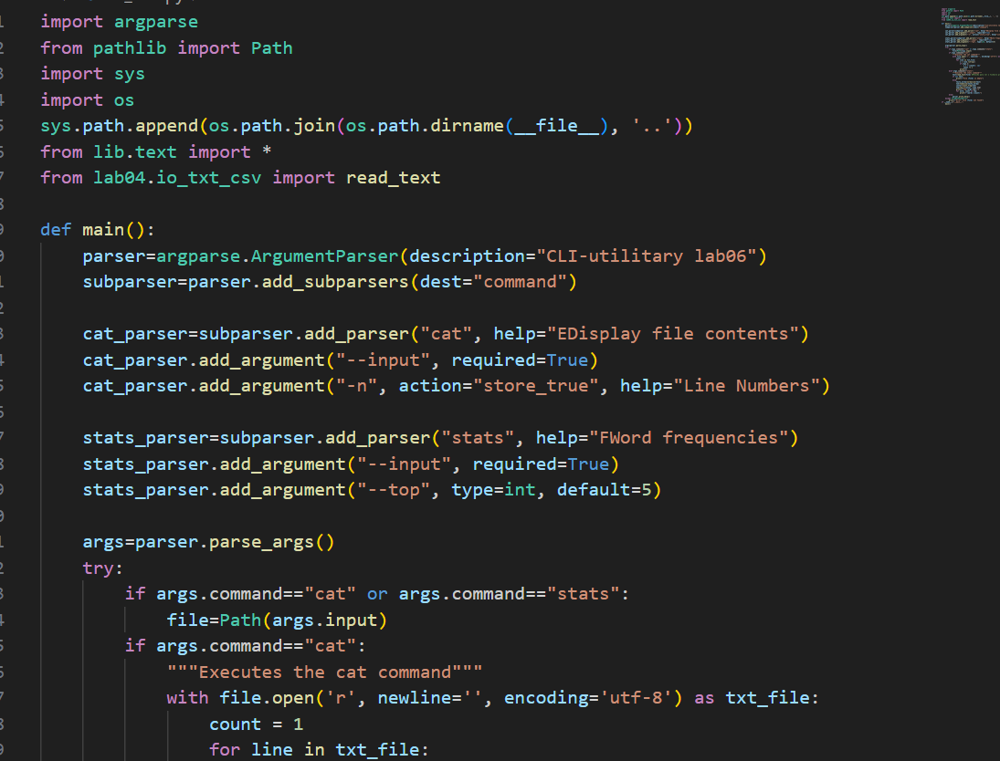
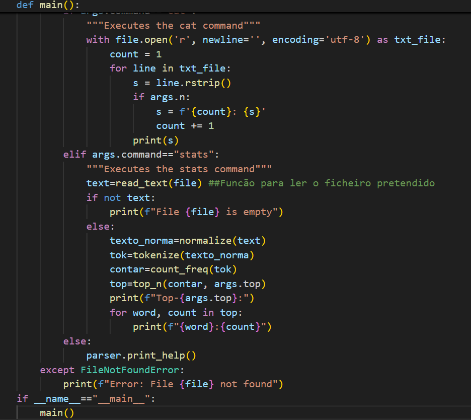
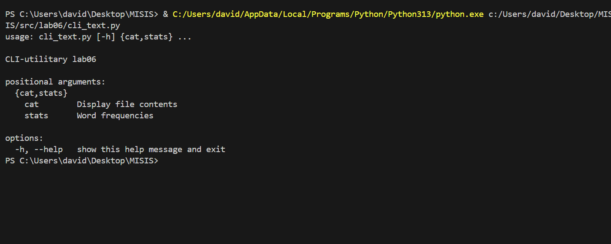
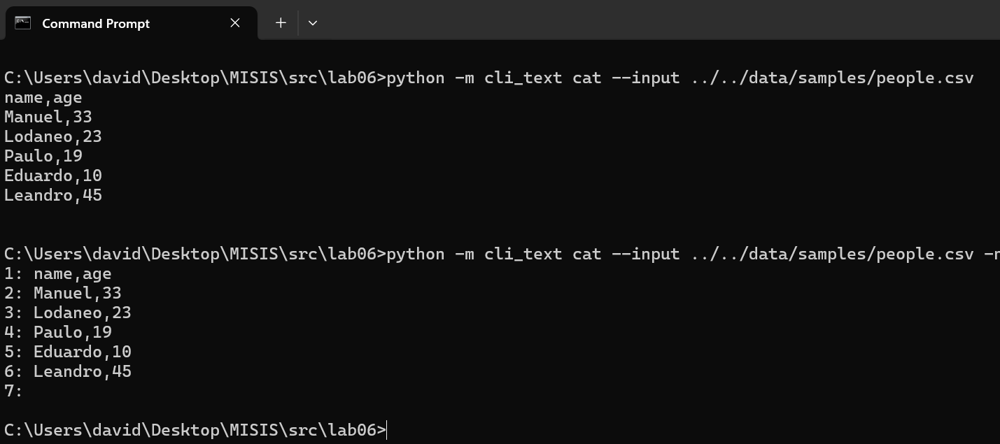
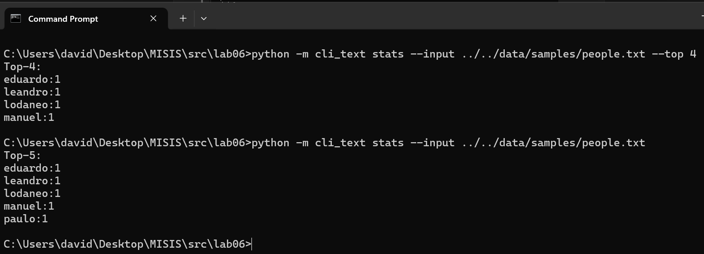
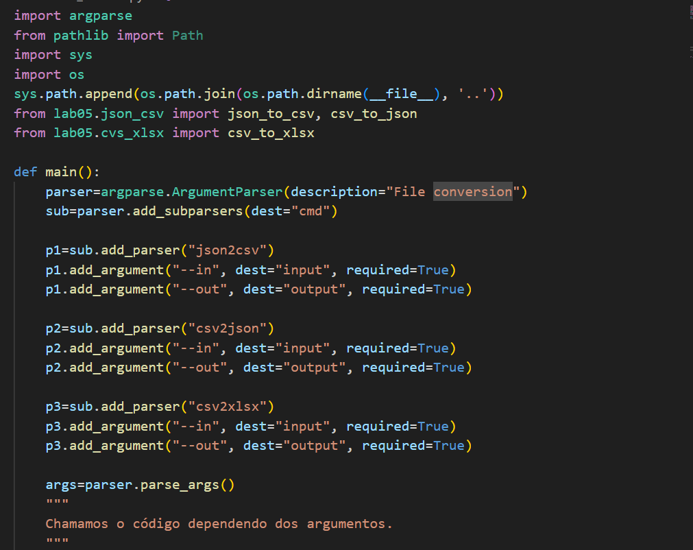
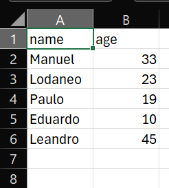

# ЛР6 — CLI‑утилиты с argparse (cat/grep‑lite + конвертеры): Техническое задание

## Задание A — cПодкоманды в одном CLI

## Code

## Help

## Result command cat

## Result command stats

## Задание B — CLI‑конвертер

