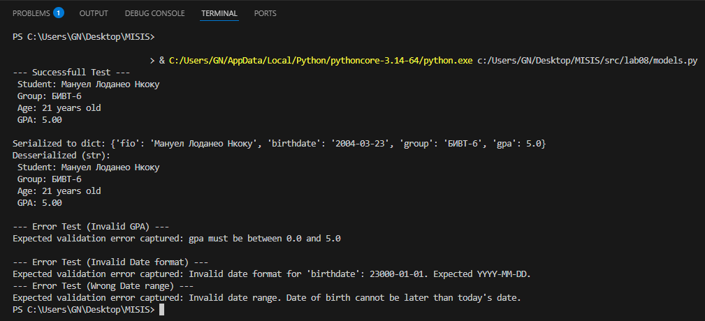
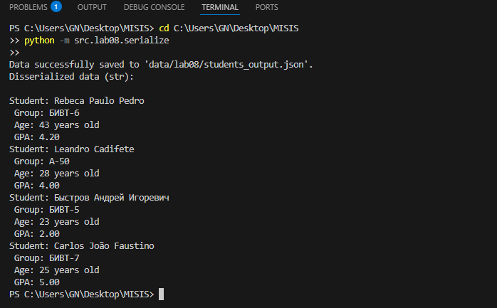
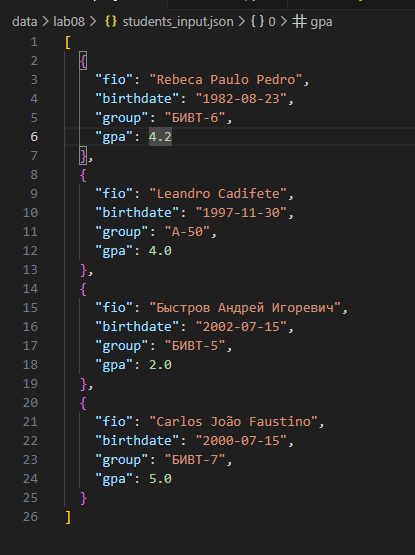
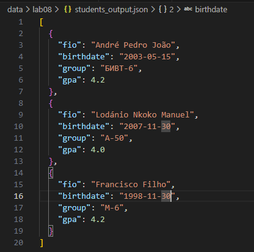

# ЛР8 – ООП в Python: @dataclass Student, методы и сериализация
## Задание A. Реализовать класс Student (models.py)

## code
```python
from dataclasses import dataclass
import datetime


# Decorator to automatically generate __init__ and __post_init__ methods.
# And armazenates datas (students' data)
@dataclass
class Student:
    fio: str
    birthdate: str
    group: str
    gpa: float

    def __post_init__(self):
        """
        Data validation after initialization (after __init__).
        Date of birth format and gpa range validations.
        Date format must be in ISO format (YYYY-MM-DD). Ex: 2025-12-01.
        Gpa must be between 0.0 and 5.0.
        """
        # Add proper validation of date format and gpa range (YYYY-MM-DD)
        try:
            # String birthdate -> Python object ISO Fortmat for DateAndTime
            birth_date_obj = datetime.date.fromisoformat(self.birthdate)
        except ValueError:
            # (Ideally, there should be raise ValueError(...) here.)
            # print("warning: birthdate format might be invalid")
            raise ValueError(
                f"Invalid date format for 'birthdate': {self.birthdate}. Expected YYYY-MM-DD."
            )
        if datetime.date.today() < birth_date_obj:
            raise ValueError(
                "Invalid date range. Date of birth cannot be later than today's date."
            )
        if not isinstance(self.gpa, float):
            self.gpa = float(self.gpa)
        if not (0.0 <= self.gpa <= 5.0):
            raise ValueError("gpa must be between 0.0 and 5.0")

    def age(self) -> int:
        """
        Calculating Age.
        """
        today = datetime.date.today()  # Gets DateAndTIme from the computer's System.
        birth_date_obj = datetime.date.fromisoformat(self.birthdate)
        years_difference = today.year - birth_date_obj.year  # Student's age.
        if (today.month, today.day) < (birth_date_obj.month, birth_date_obj.day):
            years_difference -= 1  # if the birthday hasn't arrived yet.
        return years_difference

    def to_dict(self) -> dict:
        """
        Serializes the Student object into a dictionary.
        """
        return {
            "fio": self.fio,
            "birthdate": self.birthdate,
            "group": self.group,
            "gpa": self.gpa,
        }

    @classmethod  # Allows to create a new instance of Student from an existing dictionary.
    def from_dict(cls, d: dict):
        """
        Deserializes a dictionary into a Student object.
        Uses cls() which calls __init__ and subsequently __post_init__ for validation.
        """
        return cls(
            fio=d["fio"], birthdate=d["birthdate"], group=d["group"], gpa=d["gpa"]
        )

    def __str__(self):
        """
        Returns the Student class data in string format, understandable to the user.
        """
        return (
            f"Student: {self.fio}\n"
            f" Group: {self.group}\n"
            f" Age: {self.age()} years old\n"
            f" GPA: {self.gpa:.2f}"
        )


# -----------------------------------------------#
# ------------- VALIDATIONS----------------------#
# -----------------------------------------------#

# ----------  Success test - ALL OK -------------#
if __name__ == "__main__":
    print("--- Successfull Test ---")
    try:
        student1 = Student(
            fio="Мануел Лоданео Нкоку",
            birthdate="2004-03-23",
            group="БИВТ-6",
            gpa=5,
        )
        print(f" {student1}")
        # ---------- Serializations test -----------------------#
        student_dict = student1.to_dict()  # Serialization
        print(f"\nSerialized to dict: {student_dict}")
        # Disserializations test (Creates a new object from the dict.)
        student2 = Student.from_dict(
            student_dict
        )  # Disserialize from the existing dictionary.
        print(f"Desserialized (str):\n {student2}")
    except ValueError as e:
        print(f"Error in the success test: {e}")
    # ----------  Wrong GPA - MUST RAISE GPA ERROR -------------#
    print("\n--- Error Test (Invalid GPA) ---")
    try:
        student_invalid_gpa = Student(
            fio="Мануел Лоданео Нкоку",
            birthdate="2010-01-01",
            group="БИВТ-6",
            gpa=5.5,  # Wrong GPA
        )
    except ValueError as e:
        print(f"Expected validation error captured: {e}")
    # ---------- Wrong Date format - MUST RAISE Date Error -------#
    print("\n--- Error Test (Invalid Date format) ---")
    try:
        student_invalid_date_format = Student(
            fio="Мануел Лоданео Нкоку",
            birthdate="23000-01-01",  # (or 2010/05/15) - Invalid, must be an ISO format.
            group="БИВТ-6",
            gpa=4.0,
        )
    except ValueError as e:
        print(f"Expected validation error captured: {e}")
    # ---------- Wrong Date range - MUST RAISE Date Error -------#
    print("--- Error Test (Wrong Date range) ---")
    try:
        student_invalid_date_range = Student(
            fio="Мануел Лоданео Нкоку",
            birthdate="2026-07-27",
            group="БИВТ-6",
            gpa=4.2,
        )
    except ValueError as e:
        print(f"Expected validation error captured: {e}")
```

## Test result models.py



##  Задание B. Реализовать модуль serialize.py
## code
```python
import json
from src.lab08.models import Student
from pathlib import Path


def students_to_json(students: list[Student], path: str):
    """
    Serializes datas into a JSON file.
    """
    Json_path = Path(path)
    # Certify that its a .JSON file
    if Json_path.suffix.lower() != ".json":
        print(f"The file is not of the .json type.")
        return False
    # Creates the serialization to write the serialized data to the JSON file.
    data_to_JSON = [s.to_dict() for s in students]
    try:
        with open(path, "w", encoding="utf-8") as f:
            json.dump(data_to_JSON, f, ensure_ascii=False, indent=2)
        print(f"Data successfully saved to '{path}'.")
    except ValueError as e:
        print(f"Error writing to file {path}: {e}")


def students_from_json(path) -> list[Student]:
    """
    Disserializes datas from a JSON file.
    """
    Json_path = Path(path)
    if Json_path.suffix.lower() != ".json":
        print(f"The file is not of the .json type.")
        return False
    try:
        with open(path, "r", encoding="utf-8") as f:
            data_from_json = json.load(f)
        if not isinstance(data_from_json, list):
            raise TypeError("Expected JSON list/array, but got a diferent type")
        students = []  # Creates a new empty list
        for item in data_from_json:
            try:
                # Disserialize the items in "data_from_json" and Save to the list.
                students.append(Student.from_dict(item))
            except:
                raise ValueError(f"Error processing student data from JSON: {item}")
        return students
    except:
        raise ValueError("Error: File Not Found!!!")


# --------Runing funcions--------
if __name__ == "__main__":
    students_list = [
        Student("André Pedro João", "2003-05-15", "БИВТ-6", 4.2),
        Student("Lodánio Nkoko Manuel", "2007-11-30", "A-50", 4.0),
        Student("Francisco Filho", "1998-11-30", "M-6", 4.2),
    ]
    students_to_json(students_list, "data/lab08/students_output.json")
    loaded_students = students_from_json("data/lab08/students_input.json")
    print("Disserialized data (str):\n")
    for items in loaded_students:
        print(items)
```

## Test result Serialize.py


## students_input.json


## students_output.json
