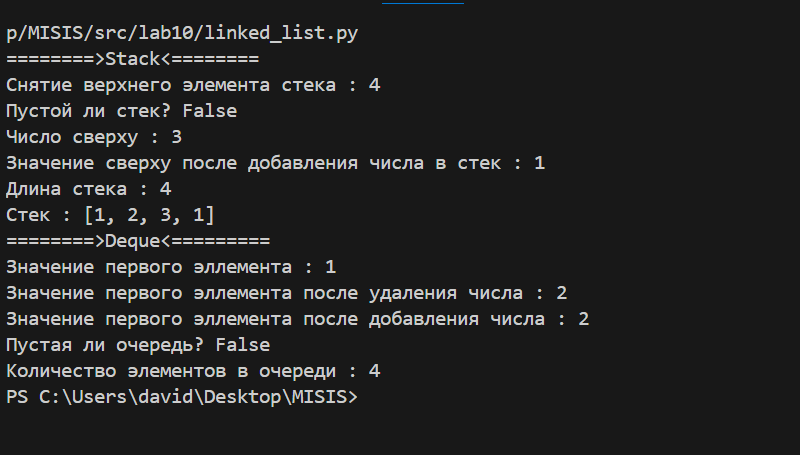
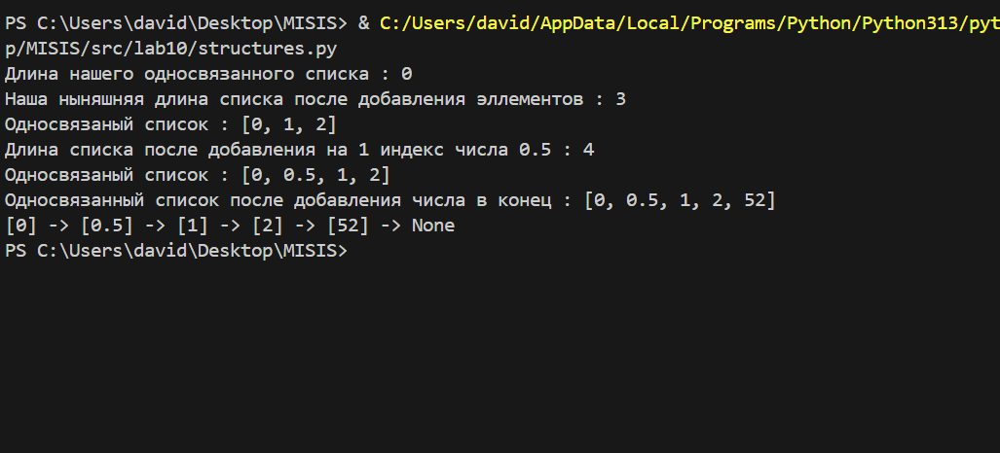

# ЛР10 — Структуры данных: Stack, Queue, Linked List и бенчмарки

## Code_Реализовать_Stack_Queue
```python
from collections import deque
from typing import Any, Optional


class Stack:
    """
    Estrutura de dados Stack (Pilha) – LIFO (Last In, First Out).

    O último elemento inserido é o primeiro a ser removido.

    Operações principais:
      - push(item)   → adiciona um elemento ao topo
      - pop()        → remove o elemento do topo
      - peek()       → retorna o elemento do topo sem remover
      - is_empty()   → verifica se a pilha está vazia
      - __len__()    → retorna o tamanho da pilha
    """

    __slots__ = ("_data",)

    def __init__(self, iterable=None) -> None:
        # Inicializa a pilha com uma lista (ou vazia, se nada for passado)
        self._data: list[Any] = list(iterable) if iterable is not None else []

    def push(self, item: Any) -> None:
        # Adiciona um elemento ao topo da pilha
        self._data.append(item)

    def pop(self) -> Any:
        # Remove e retorna o elemento do topo da pilha
        if not self._data:
            raise IndexError("Tentativa de remover elemento de uma pilha vazia")
        return self._data.pop()

    def peek(self) -> Optional[Any]:
        # Retorna o elemento do topo sem remover
        return self._data[-1] if self._data else None

    def is_empty(self) -> bool:
        # Verifica se a pilha está vazia
        return not self._data

    def __len__(self) -> int:
        # Retorna a quantidade de elementos na pilha
        return len(self._data)

    def __repr__(self) -> str:
        # Representação da pilha para debug
        return f"Stack({self._data!r})"


class Queue:
    """
    Estrutura de dados Queue (Fila) – FIFO (First In, First Out).

    O primeiro elemento inserido é o primeiro a ser removido.

    Implementada usando collections.deque para eficiência.

    Operações principais:
      - enqueue(item) → adiciona elemento ao final da fila
      - dequeue()     → remove elemento do início da fila
      - peek()        → retorna o primeiro elemento sem remover
      - is_empty()    → verifica se a fila está vazia
      - __len__()     → retorna o tamanho da fila
    """

    __slots__ = ("_data",)

    def __init__(self, iterable=None) -> None:
        # Inicializa a fila com deque (ou vazia)
        self._data: deque[Any] = deque(iterable) if iterable is not None else deque()

    def enqueue(self, item: Any) -> None:
        # Adiciona um elemento ao final da fila
        self._data.append(item)

    def dequeue(self) -> Any:
        # Remove e retorna o primeiro elemento da fila
        if not self._data:
            raise IndexError("Tentativa de remover elemento de uma fila vazia")
        return self._data.popleft()

    def peek(self) -> Optional[Any]:
        # Retorna o primeiro elemento da fila sem remover
        return self._data[0] if self._data else None

    def is_empty(self) -> bool:
        # Verifica se a fila está vazia
        return not self._data

    def __len__(self) -> int:
        # Retorna a quantidade de elementos na fila
        return len(self._data)

    def __repr__(self) -> str:
        # Representação da fila para debug
        return f"Queue({list(self._data)!r})"


# ----------------------- Exemplo de uso: Stack ----------------------- #

print('========> Stack <========')

stack = Stack([1, 2, 3, 4])

# Remove o elemento do topo da pilha
print(f'Top element removed: {stack.pop()}')

# Verifica se a pilha está vazia
print(f'Is stack empty? {stack.is_empty()}')

# Mostra o elemento do topo
print(f'Top element: {stack.peek()}')

# Adiciona um novo elemento
stack.push(1)
print(f'Top element after push: {stack.peek()}')

# Mostra o tamanho da pilha
print(f'Stack length: {len(stack)}')

# Mostra o conteúdo interno da pilha
print(f'Stack data: {stack._data}')


# ----------------------- Exemplo de uso: Queue ----------------------- #

print('========> Queue <========')

q = Queue([1, 2, 3, 4])

# Mostra o primeiro elemento da fila
print(f'First element: {q.peek()}')

# Remove o primeiro elemento
q.dequeue()
print(f'First element after dequeue: {q.peek()}')

# Adiciona um elemento ao final da fila
q.enqueue(52)
print(f'First element after enqueue: {q.peek()}')

# Verifica se a fila está vazia
print(f'Is queue empty? {q.is_empty()}')

# Mostra o tamanho da fila
print(f'Queue length: {len(q)}')

```
## Result_Stack_Queue



## Code_Реализовать_SinglyLinkedList
```python
from typing import Any, Iterator, Optional


class Node:
    __slots__ = ("value", "next")

    def __init__(self, value: Any, next: Optional["Node"] = None) -> None:
        self.value = value
        self.next = next

    def __repr__(self) -> str:
        return f"Node({self.value!r})"


class SinglyLinkedList:
    """Односвязный список.

    Атрибуты:
      - head, tail, _size

    Методы:
      - append(value)       O(1)
      - prepend(value)      O(1)
      - insert(idx, value)  O(min(idx, n)) — проход от головы
      - remove(value)       O(n) — 
      - remove_at(idx)      O(n) — 
      - __iter__, __len__, __repr__, __str__
    """

    __slots__ = ("head", "tail", "_size")

    def __init__(self, iterable=None) -> None:
        self.head: Optional[Node] = None
        self.tail: Optional[Node] = None
        self._size: int = 0
        if iterable:
            for v in iterable:
                self.append(v)

    def append(self, value: Any) -> None:
        """Добавить в конец — O(1)."""
        node = Node(value)
        if not self.head:
            self.head = node
            self.tail = node
        else:
            assert self.tail is not None
            self.tail.next = node
            self.tail = node
        self._size += 1

    def prepend(self, value: Any) -> None:
        """Добавить в начало — O(1)."""
        node = Node(value, next=self.head)
        self.head = node
        if self._size == 0:
            self.tail = node
        self._size += 1

    def insert(self, idx: int, value: Any) -> None:
        """Вставить по индексу. Допускаются idx==0 и idx==len."""
        if idx < 0 or idx > self._size:
            raise IndexError("insert index out of range")
        if idx == 0:
            self.prepend(value)
            return
        if idx == self._size:
            self.append(value)
            return

        prev = self.head
        for _ in range(idx - 1):
            assert prev is not None
            prev = prev.next
        assert prev is not None
        node = Node(value, next=prev.next)
        prev.next = node
        self._size += 1

    def remove(self, value: Any) -> None:
        """Удалить первое вхождение value. Если не найдено — ValueError."""
        prev: Optional[Node] = None
        cur = self.head
        idx = 0
        while cur:
            if cur.value == value:
                if prev is None:
                    self.head = cur.next
                else:
                    prev.next = cur.next
                if cur is self.tail:
                    self.tail = prev
                self._size -= 1
                return
            prev, cur = cur, cur.next
            idx += 1
        raise ValueError("remove: value not found in SinglyLinkedList")

    def remove_at(self, idx: int) -> None:
        """Удалить элемент по индексу. Возбуждает IndexError при неверном индексе."""
        if idx < 0 or idx >= self._size:
            raise IndexError("remove_at index out of range")
        prev: Optional[Node] = None
        cur = self.head
        for _ in range(idx):
            prev, cur = cur, cur.next  # type: ignore
        assert cur is not None
        if prev is None:
            self.head = cur.next
        else:
            prev.next = cur.next
        if cur is self.tail:
            self.tail = prev
        self._size -= 1

    def __iter__(self) -> Iterator[Any]:
        cur = self.head
        while cur:
            yield cur.value
            cur = cur.next

    def __len__(self) -> int:
        return self._size

    def __repr__(self) -> str:
        return f"SinglyLinkedList([{', '.join(repr(x) for x in self)}])"

    def __str__(self) -> str:
        parts = []
        cur = self.head
        while cur:
            parts.append(f"[{cur.value!s}]")
            cur = cur.next
        parts.append("None")
        return " -> ".join(parts)

sll = SinglyLinkedList()
print(f'Длина нашего односвязанного списка : {len(sll)}')

sll.append(1)
sll.append(2)
sll.prepend(0)
print(f'Наша ныняшняя длина списка после добавления эллементов : {len(sll)}') 
print(f'Односвязаный список : {list(sll)}')

sll.insert(1, 0.5)
print(f'Длина списка после добавления на 1 индекс числа 0.5 : {len(sll)}')
print(f'Односвязаный список : {list(sll)}')
sll.append(52)
print(f'Односвязанный список после добавления числа в конец : {list(sll)}')

print(sll) 
```
## Result_Реализовать_SinglyLinkedList


